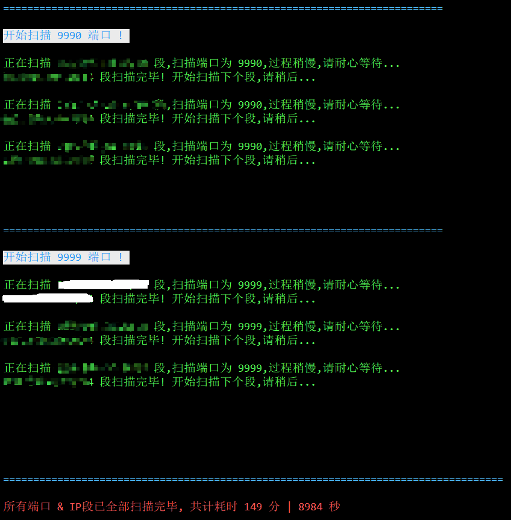
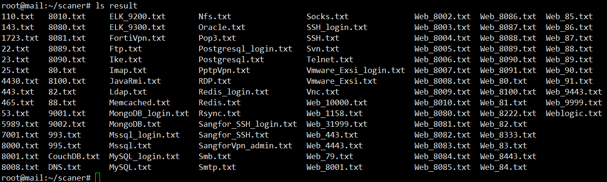

### 0x01 用法
```
Usage:
    # nohup ./MotooScanner.sh 端口列表 目标真实ip[ip段]列表 保存扫描结果的目录名[随意] &
    # nohup ./MotooScanner.sh TargetPorts.txt TargetIplist.txt Final &
    # tail -f nohup.out
```

### 0x02 执行流程
```
脚本自身没任何技术含量,纯粹是粗糙组装了下 Masscan + Nmap [ 默认只加载部分些脚本,可选 ] 相互配合进行快速探测 
[ 由于是同时针对多个ip段扫一个端口,而非针对一个ip同时扫一堆端口,加之用的常规循环(单线程),理论上对常规防护规避效果应该稍好 ]
先用masscan 集中对目标的所有真实C段进行快速端口探测,而后再利用nmap对开放相应端口的ip进行二次的精度服务识别
之后再针对一些可快速getshell的基础服务,进行初期弱口令尝试
尤其适用于一些目标规模较大[ 比如,横跨好几百个真实C段 ], 然后想从暴露在外部的各类基础服务中快速寻找突破口的场景
```

### 实测效果demo




### 脚本说明
```
脚本初衷只为尽量简化日常渗透中的一些例行的重复性动作,利用bash就地取材快速实现的一个极为廉价的外部搜集工具
所有 "扫描" 和 "弱口令探测" 的结果均已按照其所对应的 "端口" 和 "服务名" 分类保存在当前目录中的结果目录下(目录名可自定义)
分类存主要也是为了方便弟兄们,后续好再针对开放某个指定端口的ip列表进行二次集中操作
为在保证精度的情况下尽量加快速度,经过多次实测,中间省去了很多判断和校验
有些输出信息之所以没直接丢到null里,主要是为了能更清晰的看到整个过程
此处所给的nmap没有进行任何特征剔除,只是简单换了下默认的帐号密码字典,具体的需要弟兄们自行处理
要扫描的端口列表也已按能快速getshell的难以程度优先级排好序了,另外,根据平时经验基本已覆盖了一些最常见的可能会存在利用机会的服务端口
实际速度根据目标的不同,速度耗时都是不同的,用时间换精度,尽力避免重复劳动
另外,vps要靠谱,不然长时间高频大流量很容易被封,这个就需要弟兄们自己解决了,帐号密码字典不宜过多,以精度为主,建议保持在三十个以内
```


### 脚本仅限于安全研究学习和授权渗透之用
### 严禁将其用于任何恶意非法用途，由此所产生的一些法律责任，均由使用者自行承担
